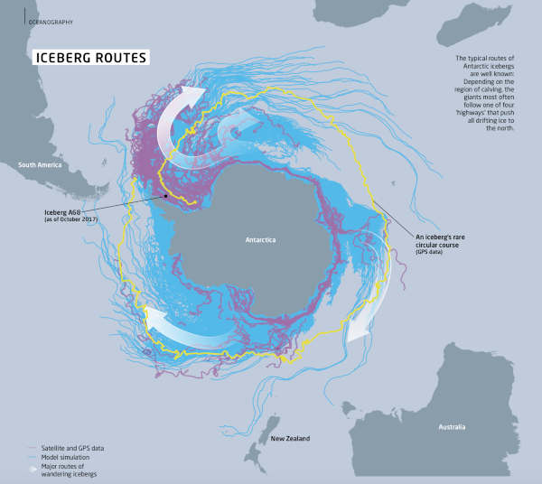

[//]: # (javascript line for adding Altmetric badges)
   
[//]: # (javascript line for adding Dimensions badges)

### Website Contents

* TOC
{:toc}

### Research

> Climate models are vital to understand and predict our changing Earth. I do my share by accounting for 
> underrepresented ocean eddies, leads in sea ice, and entirely new model components that impact climate variability
> (e.g. meltwater from drifting icebergs or stochasticity in the air-sea exchange) , so that we can be confident in our future decisions.

### Outreach / Blogposts / Interviews / Podcasts

1. **Researcher video profile for nextGEMS** with Latest Thinking [video](https://lt.org/embed/expert/516cf41c-d825-452e-8129-7730e67c8864)
   
1. **Scrollytelling news story about iceberg A23a**, the giant that calved in 1986 and stayed grounded for more than 3 decades, in [Sueddeutsche Zeitung](https://www.sueddeutsche.de/projekte/artikel/wissen/eisberg-antarktis-a23a-e962962/). 

1. **IFS-FESOM nextGEMS overview presentation** at Universidad Complutense Madrid, Spain, "Developments from Cycle 2 to Cycle 3 in IFS-FESOM", Cycle 3 Hackathon, 29 May - 2nd June 2023.

1. **Highlight presentation at EGU 2023** in Vienna, Austria, "Storm- and eddy-resolving simulations with IFS-FESOM/NEMO at the kilometre scale". Check the abstract and material [on the EGU website](https://doi.org/10.5194/egusphere-egu23-16453), [doi:10.5194/egusphere-egu23-16453](https://doi.org/10.5194/egusphere-egu23-16453)

1. Invited **Keynote presentation** about the relationship between **Digital Twins and Polar science**, 2nd MOSAiC conference in Boulder, Colorado, USA.

1. Invited talk at **ExtremWetterKongress 2022** in Hamburg, Germany. See my German talk on [YouTube](https://www.youtube.com/watch?v=OSgvIOBthd0&t=11383s)

1. Modelling expert at **Potsdam Summer School 2021**, https://potsdam-summer-school.org, 18 August 2021.

1. **Art+Science** My melting stripes, inspired by the popular warming/climate stripes, are featured in the latest newsletter of the Year of Polar Prediction Project (YOPP) as design elements [Link to PolarPredictNews #17, page 30/31 for overview map](https://www.polarprediction.net/news/polarpredictnews/)

1. **Live radio interview on National German radio** about the possible role of icebergs in transitioning between ice ages, Deutschlandfunk Kultur, in German [mp3 link](https://ondemand-mp3.dradio.de/file/dradio/2021/01/19/als_die_eisberge_weiter_wanderten_erkenntnisse_zur_drk_20210119_1737_8a8d7b94.mp3) / [link to our paper in Nature](https://doi.org/10.1038/s41586-020-03094-7) / [link to radio station](https://www.deutschlandfunkkultur.de/audio-archiv.517.de.html?drau%5Bsubmit%5D=1&drau%5Bsearchterm%5D=Rackow&drau%5Bfrom%5D=&drau%5Bto%5D=&drau%5Bbroadcast_id%5D=)

1. **Animated simulated sea ice and ocean circulation for MOSAiC TV documentary**, with Viktor Stickel/bitteschoen.tv [Link to the TV documentary](https://www.daserste.de/information/reportage-dokumentation/erlebnis-erde/videos/expedition-arktis-video-100.html) / [The documentary is nominated for the German "Grimme-Preis 2021"](https://www.ufa.de/presse/57-grimme-preis-expedition-arktis-in-der-kategorie-information-kultur-nominiert)

1. **A brief history of A68 - the world's largest iceberg**. [Link to the post @ EGU's Cryoblog](https://blogs.egu.eu/divisions/cr/2020/09/25/climate-change-cryosphere-a-brief-history-of-a68-the-worlds-largest-iceberg/)

1. **Happy birthday, A68!** [Link to the post @ AWI Eisblog](https://blogs.helmholtz.de/eisblog/2020/07/happy-birthday-a-68/)

1. **Trapped in sea ice: Educating the future generations of polar scientists**. [Link to the post @ EGU's Cryoblog](https://blogs.egu.eu/divisions/cr/2020/03/06/trapped-in-the-sea-ice-educating-the-future-generations-of-polar-scientists/)

1. **MOSAiC drift math puzzle for the annual German math calendar, with Dr. Falk Ebert (teacher at Herder-Gymnasium, Berlin)** [Link to the puzzle](https://www.mathe-im-advent.de/de/kalender/7-9/6/) / [Impressions](https://www.mathe-im-advent.de/de/neuigkeiten/2020-01-25/pvmia2019/) / [Prize ceremony with about 1000 children and pupils](https://idw-online.de/de/news730395)

1. **The IcePod: Episode 1 - The First Time**. Podcast with Kirstin Werner and Sara Pasqualetto about my participation during MOSAiC expedition to the Central Arctic. [Link to the Podcast (97 minutes!)](https://community.wmo.int/news/new-ppp-podcast-icepod)

1. **How to predict the weather on a Russian icebreaker**. [Link to the post @ CU Boulder](https://mosaic.colorado.edu/news/how-predict-weather-russian-icebreaker) 

1. **My 2017 iceberg study is a Scientific Highlight in the AWI "Kuratoriumsbericht"** [link](https://doi.org/10.1002/2016JC012513) / [Journal Highlight/Cover image](https://agupubs.onlinelibrary.wiley.com/doi/abs/10.1002/jgrc.21927/) / AGU top-downloaded paper / [AWI press release](https://www.awi.de/en/about-us/service/press/press-release/researchers-unravel-the-drivers-of-large-iceberg-movement.html) 

1. **Where is the giant iceberg from the Larsen C Ice Shelf heading?** Interview in magazine of the Climate Sciences Division at the Alfred Wegener Institute [Link to the English PDF (p.42-45)](https://www.awi.de/fileadmin/user_upload/AWI/Forschung/Besondere_Gruppen/Klimabuero/Material_Klimamagazin/RZ_AWI_Klimabro_E_low_RGB.pdf) [Deutsche Version (S.42-45)](https://www.awi.de/fileadmin/user_upload/AWI/Forschung/Besondere_Gruppen/Klimabuero/Material_Klimamagazin/RZ_AWI_Klimabro_D_low_RGB_72dpi.pdf) / [Press release](https://www.awi.de/nc/en/about-us/service/press/press-release/awi-veroeffentlicht-magazin-zur-klimaforschung-in-arktis-und-antarktis.html)

    |  |
    |:--:| 
    | *Graphic: Tanja Deutschländer/Thomas Rackow* |

1. **Ein Riese macht sich auf den Weg** Expert post about iceberg A68 with Dr. Daniela Jansen for BMBF's "Wissenschaftsjahr 2016/17 _Meere und Ozeane_". [Link to the post](https://www.wissenschaftsjahr.de/2016-17/aktuelles/das-sagen-die-experten/ein-riese-macht-sich-auf-den-weg.html)

1. Various **radio interviews and newspaper articles after iceberg A68's calving** in 2017. For example, [BBC news](https://www.bbc.com/news/science-environment-44745734), [Spiegel](https://www.spiegel.de/wissenschaft/natur/larsen-c-schelfeis-eisriese-a68-treibt-langsam-in-waermere-gewaesser-a-1226845.html), [Stern](https://www.stern.de/panorama/weltgeschehen/riesiger-eisberg-treibt-durch-antarktische-gewaesser-8346294.html), [FAZ](https://www.faz.net/aktuell/wissen/larsen-c-aufloesungstendenzen-am-suedpol-15103012.html), [Zeit](https://www.zeit.de/wissen/umwelt/2018-09/antarktis-eisberg-a68-abbruch-bewegung), [MDR](https://www.mdr.de/wissen/neuer-antarktis-eisberg-in-bewegung100.html), FM4 Austria, HR-info, or BR radio.

1. **Can Antarctic icebergs solve South Africa's water crisis?** In IQ - Wissenschaft und Forschung. [Link to the (German) radio station](https://www.br.de/nachrichten/wissen/loesen-eisberge-aus-der-antarktis-suedafrikas-trinkwasserproblem,QrZsX8Q)
{:reversed="reversed"}

### Submitted publications

1. Ackermann, L., **Rackow, T.**, Himstedt, K, Gierz, P., Knorr, G., and Lohmann, G. (**2023**): **A comprehensive Earth System Model (AWI-ESM2.1) with interactive icebergs: Effects on surface and deep ocean characteristics**, _EGUsphere_, [preprint](https://doi.org/10.5194/egusphere-2023-2061), accepted

1. B. Rabe, C. J. Cox, YC. Fang, H. F. Goessling, M. A. Granskog, M. Hoppmann, J. K. Hutchings, T. Krumpen, I. Kuznetsov, R. Lei, T. Li, W. Maslowski, M. Nicolaus, D. Perovich, O. Persson, J. Regnery, I. Rigor, M. D. Shupe, V. Sokolov, G. Spreen, T. Stanton, D. M. Watkins, E. Blockley, H. J. Buenger, S. Cole, A. Fong, J. Haapala, C. Heuzé, C. J. M. Hoppe, M. Janout, A. Jutila, C. Katlein, R. Krishfield, L. Lin, V. Ludwig, A. Morgenstern, J. O'Brien, A. Q. Zurita, **T. Rackow**, K. Riemann-Campe, A. Rinke, J. Rohde, W. Shaw, V. Smolyanitsky, A. Solomon, A. Sperling, R. Tao, J. Toole, M. Tsamados, J. Zhu, G. Zuo (**2023**): **The MOSAiC Distributed Network: observing the coupled Arctic system with multidisciplinary coordinated platforms**, [preprint](https://doi.org/10.22541/essoar.171042728.80062955/v1), accepted
{:reversed="reversed"}
<!---
1. Authors. **Title** (in revision)
{:reversed="reversed"}
-->

### Peer-reviewed publications

1. Beech, N., **Rackow, T.**, Semmler, T., and Jung, T. (**2024**): **Exploring the ocean mesoscale at reduced computational cost with FESOM 2.5: efficient modeling strategies applied to the Southern Ocean**, Geosci. Model Dev., 17, 529–543, [10.5194/gmd-17-529-2024](https://doi.org/10.5194/gmd-17-529-2024), 2024.

1. Beech, N., **Rackow, T.**, Semmler, T., Danilov, S., Wang, Q., and Jung, T. (**2022**): **Long-term evolution of ocean eddy activity in a warming world**
[link](https://doi.org/10.1038/s41558-022-01478-3) / [Nature Editorial including our paper](https://www.nature.com/articles/s41558-022-01500-8) / [News & Views comment](https://www.nature.com/articles/s41558-022-01488-1) / [AWI press release in German](https://www.awi.de/ueber-uns/service/presse/presse-detailansicht/default-1573386284.html) / [AWI press release in English](https://www.awi.de/en/about-us/service/press/single-view/default-1573386284.html)

    
    
    

    

    
1. Streffing, J., Sidorenko, D., Semmler, T., Zampieri, L., Scholz, P., Andrés-Martínez, M., Koldunov, N., **Rackow, T.**, Kjellsson, J., Goessling, H., Athanase, M., Wang, Q., Sein, D., Mu, L., Fladrich, U., Barbi, D., Gierz, P., Danilov, S., Juricke, S., Lohmann, G., and Jung, T. (**2022**): **AWI-CM3 coupled climate model: description and evaluation experiments for a prototype post-CMIP6 model**, _Geosci. Model Dev._, **15**, 6399–6427, https://doi.org/10.5194/gmd-15-6399-2022, 2022

    
    
    

    

 
1. **Rackow, T.**, Danilov, S., Goessling, H. F., Hellmer, H. H., Sein, D. V., Semmler, T., Sidorenko, D., and Jung, T. (**2022**). **Delayed Antarctic sea-ice decline in high-resolution climate change simulations**. _Nature Communications_ **13**, 637. [link](https://doi.org/10.1038/s41467-022-28259-y) 
/  / [AWI press release in German](https://www.awi.de/ueber-uns/service/presse/presse-detailansicht/ozeanwirbel-koennten-antarktisches-meereis-paradoxon-erklaeren.html) / [AWI press release in English](https://www.awi.de/en/about-us/service/press/single-view/ozeanwirbel-koennten-antarktisches-meereis-paradoxon-erklaeren.html)
    
    
    
    

    

    ---
    **2021**
    
1. Semmler, T., Jungclaus, J., Danek, C., Goessling, H.F., Koldunov, N., **Rackow, T.**, Sidorenko, D. (**2021**): **Ocean model formulation influences transient climate response**. _Journal of Geophysical Research: Oceans_, 126, e2021JC017633. [link](https://doi.org/10.1029/2021JC017633) /

    
    
    
    

    

1. Sidorenko, D., Danilov, S., Streffing, J., Fofonova, V., Goessling, H. F., Wang, Q., CabosNarvaez, W. D., Juricke, S., Koldunov, N. V., **Rackow, T.**, Scholz, P., Sein, D. V., Jung, T. **(2021)**. **AMOC variability and watermass transformations in the AWI climate model**. _Journal of Advances in Modeling Earth Systems_ 13, e2021MS002582 / [link](https://doi.org/10.1029/2021MS002582) / 

    
    
    
    

    

1. Starr, A., Hall, I.R.,  Barker, S., **Rackow, T.**, Zhang, X., Hemming, S.R., van der Lubbe, H.J.L, Knorr, G., Berke, M.A., Bigg, G.R., Cartagena, A., Jiminez-Espejo, F.J., Gong, X., Gruetzner, J., Lathika, N.,  LeVay, L.J., Robinson, R., Ziegler, M., Exp. 361 Science Party (**2021**): **Antarctic icebergs reorganize ocean circulation during Pleistocene glacials**. _Nature_ 589, 236-241. [link](https://doi.org/10.1038/s41586-020-03094-7) / [Cardiff University press release](https://www.cardiff.ac.uk/news/view/2488697-melting-icebergs-key-to-sequence-of-an-ice-age,-scientists-find) / [AWI press release in German](https://www.awi.de/ueber-uns/service/presse/presse-detailansicht/wanderlustige-eisberge.html) / [AWI press release in English](https://www.awi.de/en/about-us/service/press/single-view/wandering-icebergs.html)

    
    
    
    

    

1. Barbat, M. M., **Rackow, T.**, Wesche, C., Hellmer, H. H., and Mata, M. M (**2021**): **Automated iceberg tracking with a machine learning approach applied to SAR imagery: A Weddell Sea case study**. _ISPRS Journal of Photogrammetry and Remote Sensing_ 172, [link](https://authors.elsevier.com/a/1cMa63I9x1cgfG)

    
    
    
    

    

    ---
    **2020**

1. Semmler, T., Danilov, S., Gierz, P., Goessling, H. F., Hegewald, J., Hinrichs, C., Koldunov, N., Khosravi, N., Mu, L., **Rackow, T.**, Sein, D., Sidorenko, D., Wang, Q., Jung, T. (**2020**): **Simulations for CMIP6 with the AWI climate model AWI-CM-1-1**. _Journal of Advances in Modeling Earth Systems_ 12, e2019MS002009. [link](https://doi.org/10.1029/2019MS002009)

    
    
    
    

    

1. Krumpen, T., Birrien, F., Kauker, F., **Rackow, T.**, von Albedyll, L., Angelopoulos, M., Belter, H. J., Bessonov, V., Damm, E., Dethloff, K., Haapala, J., Haas, C., Harris, C., Hendricks, S., Hoelemann, J., Hoppmann, M., Kaleschke, L., Karcher, M., Kolabutin, N., Lei, R., Lenz, J., Morgenstern, A., Nicolaus, M., Nixdorf, U., Petrovsky, T., Rabe, B., Rabenstein, L., Rex, M., Ricker, R., Rohde, J., Shimanchuk, E., Singha, S., Smolyanitsky, V., Sokolov, V., Stanton, T., Timofeeva, A., and Tsamados, M., and Watkins, D. (**2020**): **The MOSAiC ice floe: sediment-laden survivor from the Siberian shelf**, _The Cryosphere_, [link](https://doi.org/10.5194/tc-14-2173-2020) / [EGU Highlight Article](https://www.the-cryosphere.net/highlight_articles.html) / [EGU press release](https://www.egu.eu/news/665/first-findings-from-the-mosaic-floe/) / [AWI press release](https://www.awi.de/en/about-us/service/press/press-release/the-latest-findings-on-the-mosaic-floe.html)

    
    
    
    

    

    
    

    

1. Bracegirdle, T. J., Krinner, G., Tonelli, M., F. Haumann, A., Naughten, K. A., **Rackow, T.**, Roach, L. A., Wainer, I. (**2020**). **Twenty first century changes in Antarctic and Southern Ocean surface climate in CMIP6**. _Atmospheric Science Letters._ [link](https://doi.org/10.1002/asl.984)
    
    
    
    
    

    

    
1. **Rackow, T.** and Juricke, S. (**2020**): **Flow‐dependent stochastic coupling for climate models with high ocean‐to‐atmosphere resolution ratio**, _Quarterly Journal of the Royal Meteorological Society_, 146 (726), pp. 284-300. [link](https://doi.org/10.1002/qj.3674) / [citation](https://rmets.onlinelibrary.wiley.com/action/downloadCitation) / top-downloaded paper

    
    
    
    

    

1. Bracegirdle, T. J., Holmes, C. R., Hosking, J. S., Marshall, G. J., Osman, M., Patterson, M., and **Rackow, T.** (**2020**): **Improvements in Circumpolar Southern Hemisphere Extratropical Atmospheric Circulation in CMIP6 Compared to CMIP5**. _Earth and Space Science_, 7, e2019EA001065. [link](https://doi.org/10.1029/2019EA001065)

    
    
    
    

    

1. Roach, L. A., Dörr, J., Holmes, C. R., Massonnet, F., Blockley, E. W., Notz, D., **Rackow, T.**, Raphael, M. N., O'Farrell S. P., Bailey, D. A., Bitz, C. M. (**2020**): **Antarctic sea ice area in CMIP6**. _Geophysical Research Letters_, 47, e2019GL086729. [doi:10.1029/2019GL086729](https://doi.org/10.1029/2019GL086729) | AGU top 10% most-downloaded paper 2020

    
    
    
    

    

    ---
    **2019**

1. **Rackow, T.**, Sein, D. V., Semmler, T., Danilov, S., Koldunov, N. V., Sidorenko, D., Wang, Q., and Jung, T. (**2019**): 
**Sensitivity of deep ocean biases to horizontal resolution in prototype CMIP6 simulations with AWI-CM1.0**, _Geoscientific Model Development_, 12 (7), pp. 2635-2656. [link](https://doi.org/10.5194/gmd-12-2635-2019) | [bibTeX](https://www.geosci-model-dev.net/12/2635/2019/gmd-12-2635-2019.bib) | [videos](https://zenodo.org/record/2483055#.XshfKC1Xa_U)

    
    
    
    

    

1. Barbat, M. M., **Rackow, T.**, Hellmer, H. H., Wesche, C., and Mata, M. M. (**2019**): 
**Three years of near‐coastal Antarctic iceberg distribution from a machine learning approach applied to SAR imagery**, _Journal of Geophysical Research: Oceans_. [link](https://doi.org/10.1029/2019JC015205) / [iceberg distributions for 1997, 2000, 2008](https://goal.furg.br/producao-cientifica/supplements/201-sup-2019)

    
    
    
    

    

1. Sidorenko, D., Goessling, H. F., Koldunov, N., Scholz, P., Danilov, S., Barbi, D., Cabos, W., Gurses, O., Harig, S., Hinrichs, C., Juricke, S., Lohmann, G., Losch, M., Mu, L., **Rackow, T.**, Rakowsky, N., Sein, D. V., Semmler, T., Shi, X., Stepanek, C., Streffing, J., Wang, Q., Wekerle, C., Yang, H., and Jung, T. (**2019**): 
**Evaluation of FESOM2.0 Coupled to ECHAM6.3: Preindustrial and HighResMIP Simulations**,
_Journal of Advances in Modeling Earth Systems_, 11 (11), pp. 3794-3815. [link](https://doi.org/10.1029/2019MS001696)

    
    
    
    

    

    ---
    **2018**
    
1. **Rackow, T.**, Goessling, H. F., Jung, T., Sidorenko, D., Semmler, T., Barbi, D., and Handorf, D. (**2018**): 
**Towards multi-resolution global climate modeling with ECHAM6-FESOM. Part II: climate variability**, _Climate Dynamics_, 50. [link](https://doi.org/10.1007/s00382-016-3192-6)

    
    
    
    

    

1. Sein, D. V., Koldunov, N. V., Danilov, S., Sidorenko, D., Wekerle, C., Cabos, W., **Rackow, T.**, Scholz, P., Semmler, T., Wang, Q., and Jung, T. (**2018**): 
**The Relative Influence of Atmospheric and Oceanic Model Resolution on the Circulation of the North Atlantic Ocean in a Coupled Climate Model**, _Journal of Advances in Modeling Earth Systems_. [link](https://doi.org/10.1029/2018MS001327)

    
    
    
    

    

    ---
    **2017**
    
1. **Rackow, T.**, Wesche, C., Timmermann, R., Hellmer, H., Juricke, S., and Jung, T. (**2017**): 
**A simulation of small to giant Antarctic iceberg evolution: Differential impact on climatology estimates**, _Journal of Geophysical Research: Oceans_. [link](https://doi.org/10.1002/2016JC012513) | [Journal Highlight/Cover image](https://agupubs.onlinelibrary.wiley.com/doi/abs/10.1002/jgrc.21927/) | AGU top-downloaded paper / [AWI press release](https://www.awi.de/en/about-us/service/press/press-release/researchers-unravel-the-drivers-of-large-iceberg-movement.html)  

    
    
    
    

    

1. Sein, D. V., Koldunov, N. V., Danilov, S., Wang, Q., Sidorenko, D., Fast, I., **Rackow, T.**, Cabos, W., and Jung, T. (**2017**): 
**Ocean Modeling on a Mesh With Resolution Following the Local Rossby Radius**, _Journal of Advances in Modeling Earth Systems_. [link](https://doi.org/10.1002/2017MS001099)

    
    
    
    

    

1. Zadra, A., Williams, K., Frassoni, A., Rixen, M., Adames, Á. F., Berner, J., Bouyssel, F., Casati, B., Christensen, H., Ek, M. B., Flato, G., Huang, Y., Judt, F., Lin, H., Maloney, E., Merryfield, W., van Niekerk, A., **Rackow, T.**, Saito, K., Wedi, N., and Yadav, P. (**2017**): 
**Systematic Errors in Weather and Climate Models: Nature, Origins, and Way Forward**, _Bulletin of the American Meteorological Society_. [link](https://doi.org/10.1175/BAMS-D-17-0287.1)

    
    
    
    

    

    ---
    **pre-2017**

1. Sidorenko, D., **Rackow, T.**, Jung, T., Semmler, T., Barbi, D., Danilov, S., Dethloff, K., Dorn, W., Fieg, K., Goessling, H. F., Handorf, D., Harig, S., Hiller, W., Juricke, S., Losch, M., Schröter, J., Sein, D., and Wang, Q. (**2015**): 
**Towards multi-resolution global climate modeling with ECHAM6–FESOM. Part I: model formulation and mean climate**, _Climate Dynamics_, 44 (3), pp. 757-780. [link](https://doi.org/10.1007/s00382-014-2290-6)

    
    
    
    

    

1. Juricke, S., Lemke, P., Timmermann, R., and **Rackow, T.** (**2013**):
**Effects of Stochastic Ice Strength Perturbation on Arctic Finite Element Sea Ice Modeling**, _Journal of Climate_, 26 (11), pp. 3785-3802. [link](https://doi.org/10.1175/JCLI-D-12-00388.1)
{:reversed="reversed"}

    

Dimensions badges are only shown for papers with at least one citation; Altmetric badges are shown in addition for papers that received a high media attention (score of at least 20).
   
   
### Other publications

1. **Fixing water and energy budget imbalances in the Integrated Forecasting System**. Becker, T., **Rackow, T.**, Pedruzo, X., Sandu, I., Forbes, R., Diamantakis, M., Bechtold, P., and Polichtchouk, I. (2022). ECMWF newsletter, Number 172. [Read it](https://www.ecmwf.int/en/newsletter/172/news/fixing-water-and-energy-budget-imbalances-integrated-forecasting-system)

1. **Contributing author for the BMBF Polarforschungsagenda**, POLARREGIONEN IM WANDEL, Konzeptpapier des Mare:N-Begleitkreises [PDF](https://www.fona.de/medien/pdf/Forschungsagenda_Polarregionen_Konzeptpapier_des_MAREN_Begleitkreises_Mai_2021.pdf)

1. A set of illustrations for the kids story **Endangered - But Still There Is Hope** by Dr. Stephan Juricke, February 2021, in Volume II of the book series **Once upon a time...  a scientific fairy tale**. [PDF](https://sites.google.com/view/onceuponatime-scientific-story/downloads/)

1. Cruise report about Leg1a of MOSAiC Expedition [chapter 5.4: Weather and Ice forecasts](https://epic.awi.de/id/eprint/52409/1/BzPM_0744_2020.pdf). **The Expedition AF122/1 - Setting up the MOSAiC Distributed Network in October 2019 with Research Vessel AKADEMIK FEDOROV**. Edited by T. Krumpen and V. Sokolov / [ePIC entry](https://epic.awi.de/id/eprint/52409/)
{:reversed="reversed"}

### Science Art

{::options parse_block_html="false" /}

1. **Climate meets music: Global mean temperature rise in sync with trending music** based on data from MetOffice ([Global HadCRUT5 Analysis](https://crudata.uea.ac.uk/cru/data/temperature/)) for 1850-2020:

    <blockquote class="tiktok-embed" cite="https://www.tiktok.com/@polarthomas/video/6941421084386381062" data-video-id="6941421084386381062" style="max-width: 605px;min-width: 325px;" > <section> <a target="_blank" title="@polarthomas" href="https://www.tiktok.com/@polarthomas">@polarthomas</a> 
<a title="nomoreemptypromises" target="_blank" href="https://www.tiktok.com/tag/nomoreemptypromises">##NoMoreEmptyPromises</a> ! <a title="climatestrike" target="_blank" href="https://www.tiktok.com/tag/climatestrike">##climatestrike</a> #c<a title="climatechange" target="_blank" href="https://www.tiktok.com/tag/climatechange">#limatechange #</a>c<a title="climatecrisis" target="_blank" href="https://www.tiktok.com/tag/climatecrisis">#limatecrisis #</a>c<a title="climate" target="_blank" href="https://www.tiktok.com/tag/climate">#limate #</a>c<a title="climatejustice" target="_blank" href="https://www.tiktok.com/tag/climatejustice">#limatejustice @</a>l@luisamneubauer f@fridaysforfutureberlin g<a title="gretathunberg" target="_blank" href="https://www.tiktok.com/tag/gretathunberg">#retathunberg</a>
 <a target="_blank" title="♬ Roses (Imanbek Remix) - SAINt JHN" href="https://www.tiktok.com/music/Roses-Imanbek-Remix-6745161928949106690">♬ Roses (Imanbek Remix) - SAINt JHN</a> </section>
    </blockquote> 
    

1. **Regional melting stripes for the Arctic and Antarctic** based on data from [NASA](https://earth.gsfc.nasa.gov/cryo/data/arcticantarctic-sea-ice-time-series) for 1979-2017

<blockquote class="twitter-tweet">
My <a href="https://twitter.com/hashtag/SciArt?src=hash&amp;ref_src=twsrc%5Etfw">#SciArt</a> is featured in the latest <a href="https://twitter.com/polarprediction?ref_src=twsrc%5Etfw">@polarprediction</a> magazine 🥳 edited by <a href="https://twitter.com/kirstinwerner?ref_src=twsrc%5Etfw">@kirstinwerner</a>   &quot;Melting-stripes&quot; for <a href="https://twitter.com/hashtag/Arctic?src=hash&amp;ref_src=twsrc%5Etfw">#Arctic</a> and <a href="https://twitter.com/hashtag/Antarctic?src=hash&amp;ref_src=twsrc%5Etfw">#Antarctic</a> <a href="https://twitter.com/hashtag/seaice?src=hash&amp;ref_src=twsrc%5Etfw">#seaice</a> inspired by the popular climate stripes <a href="https://twitter.com/ed_hawkins?ref_src=twsrc%5Etfw">@ed_hawkins</a> <a href="https://twitter.com/alxrdk?ref_src=twsrc%5Etfw">@alxrdk</a> <a href="https://twitter.com/hashtag/ShowYourStripes?src=hash&amp;ref_src=twsrc%5Etfw">#ShowYourStripes</a> ▶️ <a href="https://t.co/zYdOS10D3i">https://t.co/zYdOS10D3i</a> <a href="https://t.co/tK9sUqMW0B">https://t.co/tK9sUqMW0B</a> <a href="https://t.co/T330uwbhHF">pic.twitter.com/T330uwbhHF</a>
&mdash; Thomas Rackow 🧊 (@thomas_rackow) <a href="https://twitter.com/thomas_rackow/status/1366379886957522945?ref_src=twsrc%5Etfw">March 1, 2021</a></blockquote> 

1. Another **"Flatten the Curve" illustration for Earth Day 2020 and the Scientists 4 Future** [Link](https://twitter.com/thomas_rackow/status/1252965060210810880?s=20) / [Instagram](https://www.instagram.com/stories/highlights/18031720570259082/)

1. Illustration for the **Sea Ice Drift Forecast Experiment (SIDFEx)** [Link](https://www.instagram.com/p/CALB26mq5c1/) / [ECMWF's twitter](https://twitter.com/ECMWF/status/1311960666920628224?s=20)

1. **Contributed the piece "Flatten the Curve" to a virtual exhibition in September 2020 organized by Pint of Science UK** about COVID19 and Climate Change: "Covid19 and climate change teach us that we should listen to the science. Climate projections until the end of the 21st century are based on possible future scenarios of greenhousegas emissions. While surface temperature is projected to "go through the roof" for the highest emission scenario, more agressive mitigation scenarios provide reason to stay optimistic, because the temperature curves "flatten" back towards the temperature range during which human civilization was striving. "Flattening the curve" thus applies to both disciplines. It is in our hands to stop negative impacts of the coronavirus and prevent runaway climate change." [Link to the virtual exhibition @ kunstmatrix](https://art.kunstmatrix.com/apps/artspaces/dist/index.html?timestamp=1599155829410#/?exhibition=2115625&language=en&splashscreen=false&hideBranding=false&returnURL=https:%2F%2Fpintofscience.co.uk%2Fcreativereactions%2F) / [Instagram](https://www.instagram.com/stories/highlights/18031720570259082/)

1. **The (Drawn) Distributed Network Around Polarstern**, MOSAiC Expedition [Zenodo link](https://doi.org/10.5281/zenodo.3696853)

1. **MOSAiC farewell illustration** for Polarstern and Akademik Fedorov leaving Tromso in September 2019 [e.g. MOSAiC Mondays newsletter](https://mosaic.colorado.edu/education/mosaic-mondays/mosaic-monday-september-21-2020) / [Polarprediction](https://www.instagram.com/p/B2oExPho01S/?utm_source=ig_web_copy_link)
    

    <blockquote class="instagram-media" data-instgrm-captioned data-instgrm-permalink="https://www.instagram.com/p/B2oExPho01S/?utm_source=ig_embed&amp;utm_campaign=loading" data-instgrm-version="12" style=" background:#FFF; border:0; border-radius:3px; box-shadow:0 0 1px 0 rgba(0,0,0,0.5),0 1px 10px 0 rgba(0,0,0,0.15); margin: 1px; max-width:540px; min-width:326px; padding:0; width:99.375%; width:-webkit-calc(100% - 2px); width:calc(100% - 2px);">
 <a href="https://www.instagram.com/p/B2oExPho01S/?utm_source=ig_embed&amp;utm_campaign=loading" style=" background:#FFFFFF; line-height:0; padding:0 0; text-align:center; text-decoration:none; width:100%;" target="_blank"> 
 

 
 

 

 
<svg width="50px" height="50px" viewBox="0 0 60 60" version="1.1" xmlns="https://www.w3.org/2000/svg" xmlns:xlink="https://www.w3.org/1999/xlink"><g stroke="none" stroke-width="1" fill="none" fill-rule="evenodd"><g transform="translate(-511.000000, -20.000000)" fill="#000000"><g><path d="M556.869,30.41 C554.814,30.41 553.148,32.076 553.148,34.131 C553.148,36.186 554.814,37.852 556.869,37.852 C558.924,37.852 560.59,36.186 560.59,34.131 C560.59,32.076 558.924,30.41 556.869,30.41 M541,60.657 C535.114,60.657 530.342,55.887 530.342,50 C530.342,44.114 535.114,39.342 541,39.342 C546.887,39.342 551.658,44.114 551.658,50 C551.658,55.887 546.887,60.657 541,60.657 M541,33.886 C532.1,33.886 524.886,41.1 524.886,50 C524.886,58.899 532.1,66.113 541,66.113 C549.9,66.113 557.115,58.899 557.115,50 C557.115,41.1 549.9,33.886 541,33.886 M565.378,62.101 C565.244,65.022 564.756,66.606 564.346,67.663 C563.803,69.06 563.154,70.057 562.106,71.106 C561.058,72.155 560.06,72.803 558.662,73.347 C557.607,73.757 556.021,74.244 553.102,74.378 C549.944,74.521 548.997,74.552 541,74.552 C533.003,74.552 532.056,74.521 528.898,74.378 C525.979,74.244 524.393,73.757 523.338,73.347 C521.94,72.803 520.942,72.155 519.894,71.106 C518.846,70.057 518.197,69.06 517.654,67.663 C517.244,66.606 516.755,65.022 516.623,62.101 C516.479,58.943 516.448,57.996 516.448,50 C516.448,42.003 516.479,41.056 516.623,37.899 C516.755,34.978 517.244,33.391 517.654,32.338 C518.197,30.938 518.846,29.942 519.894,28.894 C520.942,27.846 521.94,27.196 523.338,26.654 C524.393,26.244 525.979,25.756 528.898,25.623 C532.057,25.479 533.004,25.448 541,25.448 C548.997,25.448 549.943,25.479 553.102,25.623 C556.021,25.756 557.607,26.244 558.662,26.654 C560.06,27.196 561.058,27.846 562.106,28.894 C563.154,29.942 563.803,30.938 564.346,32.338 C564.756,33.391 565.244,34.978 565.378,37.899 C565.522,41.056 565.552,42.003 565.552,50 C565.552,57.996 565.522,58.943 565.378,62.101 M570.82,37.631 C570.674,34.438 570.167,32.258 569.425,30.349 C568.659,28.377 567.633,26.702 565.965,25.035 C564.297,23.368 562.623,22.342 560.652,21.575 C558.743,20.834 556.562,20.326 553.369,20.18 C550.169,20.033 549.148,20 541,20 C532.853,20 531.831,20.033 528.631,20.18 C525.438,20.326 523.257,20.834 521.349,21.575 C519.376,22.342 517.703,23.368 516.035,25.035 C514.368,26.702 513.342,28.377 512.574,30.349 C511.834,32.258 511.326,34.438 511.181,37.631 C511.035,40.831 511,41.851 511,50 C511,58.147 511.035,59.17 511.181,62.369 C511.326,65.562 511.834,67.743 512.574,69.651 C513.342,71.625 514.368,73.296 516.035,74.965 C517.703,76.634 519.376,77.658 521.349,78.425 C523.257,79.167 525.438,79.673 528.631,79.82 C531.831,79.965 532.853,80.001 541,80.001 C549.148,80.001 550.169,79.965 553.369,79.82 C556.562,79.673 558.743,79.167 560.652,78.425 C562.623,77.658 564.297,76.634 565.965,74.965 C567.633,73.296 568.659,71.625 569.425,69.651 C570.167,67.743 570.674,65.562 570.82,62.369 C570.966,59.17 571,58.147 571,50 C571,41.851 570.966,40.831 570.82,37.631"></path></g></g></g></svg>

 
 Sieh dir diesen Beitrag auf Instagram an

 

 

 

 

 

 

 

 

 

</a> 
 <a href="https://www.instagram.com/p/B2oExPho01S/?utm_source=ig_embed&amp;utm_campaign=loading" style=" color:#000; font-family:Arial,sans-serif; font-size:14px; font-style:normal; font-weight:normal; line-height:17px; text-decoration:none; word-wrap:break-word;" target="_blank">Off you Go, #Polarstern! Waving Goodbye and wishing all expedition members a successful first leg of @mosaic_expedition see link in bio Illustration by @polarthomas</a>
 
Ein Beitrag geteilt von <a href="https://www.instagram.com/polarprediction/?utm_source=ig_embed&amp;utm_campaign=loading" style=" color:#c9c8cd; font-family:Arial,sans-serif; font-size:14px; font-style:normal; font-weight:normal; line-height:17px;" target="_blank"> Year of Polar Prediction</a> (@polarprediction) am <time style=" font-family:Arial,sans-serif; font-size:14px; line-height:17px;" datetime="2019-09-20T08:22:50+00:00">Sep 20, 2019 um 1:22 PDT</time>

</blockquote> 
    
    

1. **Arctic sea ice decrease animation resembling the 1st ever image of a black hole**
    

    <!-- first tweet -->
    <blockquote class="twitter-tweet">
To communicate the <a href="https://twitter.com/hashtag/gravity?src=hash&amp;ref_src=twsrc%5Etfw">#gravity</a> of the situation, I visualised Arctic <a href="https://twitter.com/hashtag/seaice?src=hash&amp;ref_src=twsrc%5Etfw">#seaice</a> decrease resembling the 1st ever image of a <a href="https://twitter.com/hashtag/BlackHole?src=hash&amp;ref_src=twsrc%5Etfw">#BlackHole</a> <a href="https://twitter.com/ehtelescope?ref_src=twsrc%5Etfw">@ehtelescope</a>. Colors are brighter closer to the &quot;ice-free&quot; event horizon. <a href="https://twitter.com/hashtag/SeaIceMatters?src=hash&amp;ref_src=twsrc%5Etfw">#SeaIceMatters</a> <a href="https://twitter.com/hashtag/ClimateChangeSucks?src=hash&amp;ref_src=twsrc%5Etfw">#ClimateChangeSucks</a> <a href="https://twitter.com/AWI_Media?ref_src=twsrc%5Etfw">@AWI_media</a> <a href="https://twitter.com/ed_hawkins?ref_src=twsrc%5Etfw">@ed_hawkins</a> <a href="https://twitter.com/JannaLevin?ref_src=twsrc%5Etfw">@JannaLevin</a> <a href="https://twitter.com/ZLabe?ref_src=twsrc%5Etfw">@ZLabe</a> <a href="https://t.co/2IRoXjoMf4">https://t.co/2IRoXjoMf4</a> <a href="https://t.co/tlO73HHDhV">pic.twitter.com/tlO73HHDhV</a>
&mdash; Thomas Rackow (@thomas_rackow) <a href="https://twitter.com/thomas_rackow/status/1128935213453783040?ref_src=twsrc%5Etfw">May 16, 2019</a></blockquote>
    
    

1. **Melting Stripes for Arctic and Antarctic sea ice** [Arctic](https://twitter.com/thomas_rackow/status/1122796983981309955?s=20) / [Antarctic](https://twitter.com/thomas_rackow/status/1149256624349077506?s=20)
    

    <!-- second tweet -->
    <blockquote class="twitter-tweet">
Meanwhile, around Antarctica...: September <a href="https://twitter.com/hashtag/seaice?src=hash&amp;ref_src=twsrc%5Etfw">#seaice</a> extent over 1979-2018 was stable (slightly expanding), but after 2014 a rather rapid retreat set in〽️. <a href="https://twitter.com/hashtag/showyourstripes?src=hash&amp;ref_src=twsrc%5Etfw">#showyourstripes</a> <a href="https://twitter.com/ed_hawkins?ref_src=twsrc%5Etfw">@ed_hawkins</a> <a href="https://twitter.com/hashtag/meltingstripes?src=hash&amp;ref_src=twsrc%5Etfw">#meltingstripes</a> <a href="https://t.co/WrzQL3OSpG">https://t.co/WrzQL3OSpG</a> <a href="https://t.co/0BOtOPnkR6">pic.twitter.com/0BOtOPnkR6</a>
&mdash; Thomas Rackow (@thomas_rackow) <a href="https://twitter.com/thomas_rackow/status/1149256624349077506?ref_src=twsrc%5Etfw">July 11, 2019</a></blockquote> 
    
    

1. **"Breaking the ice" illustration for the Year of Polar Prediction (YOPP)** [Link](https://twitter.com/polarprediction/status/620919545402933248)
{:reversed="reversed"}

    <!-- first tweet -->
    <blockquote class="twitter-tweet">
<a href="https://twitter.com/hashtag/polarpredict?src=hash&amp;ref_src=twsrc%5Etfw">#polarpredict</a> <a href="http://t.co/QEx2WADgqm">pic.twitter.com/QEx2WADgqm</a>
&mdash; Polar Prediction (@polarprediction) <a href="https://twitter.com/polarprediction/status/620919545402933248?ref_src=twsrc%5Etfw">July 14, 2015</a></blockquote>
    

### Fieldwork 

1. **Expedition AF122/1 - Setting up the MOSAiC Distributed Network around Polarstern in October 2019 with Research Vessel AKADEMIK DEDOROV during the MOSAiC expedition to the Central Arctic Ocean** / My roles: ice manager, (un)loading cargo operations / YOPP lecturer for MOSAiC School, see [Cruise Report chapter 5.4](https://epic.awi.de/id/eprint/52409/1/BzPM_0744_2020.pdf) / [Blogpost by Natalia Ribeiro](https://mosaic-expedition.org/mosaic-school-week-3/)

### Peer-reviewing activity

Reviewer for Journal of Climate, Nature Communications, Journal of Advances in Modeling Earth Systems, Scientific Reports, Ocean Modelling, Climate Dynamics, Polar Research; Review Editor at Frontiers in Marine Science

[Verified peer-reviews at Publons](https://publons.com/researcher/3666613/thomas-rackow/peer-review/) / [Review Editor at Frontiers in Marine Science](https://loop.frontiersin.org/people/1723503/bio)

### Panels and other responsibilities

nextGEMS Executive Board member

nextGEMS ECS representative

### Scientific profiles / social media

    <a itemprop="sameAs" content="https://orcid.org/0000-0002-5468-575X" href="https://orcid.org/0000-0002-5468-575X" target="orcid.widget" rel="me noopener noreferrer" style="vertical-align:top;">https://orcid.org/0000-0002-5468-575X</a>

[Scopus Author ID](https://www.scopus.com/authid/detail.uri?authorId=55764106200) / [Web Of Science ResearcherID](https://publons.com/researcher/AAP-2735-2020/) / [ResearchGate profile](https://www.researchgate.net/profile/Thomas_Rackow) / [Google Scholar profile](https://scholar.google.de/citations?user=P5Ebb8cAAAAJ&hl=eng) / [AWI ePIC repository](https://epic.awi.de/view/ldapid/trackow.html) / [Twitter profile @thomas_rackow](https://twitter.com/thomas_rackow) / [LinkedIn](www.linkedin.com/in/thomas-rackow) / [Loop](https://loop.frontiersin.org/people/1723503/bio)
